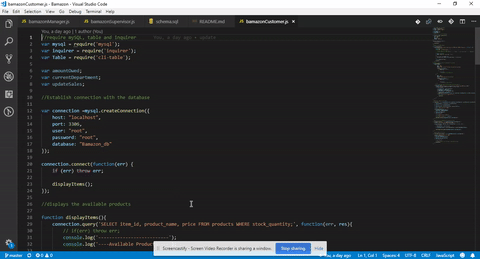

# Bamazon

the goal of this project is to create an Amazon like store front using Node.js and MySQL.
The app will take in orders from customers and deplete stock from the store's inventory, track product sales across departments and provide a summary of the highest-grossing departments in the store.

# BamazonCustomer module

this module lets users select a product to purchase, enter the number of item they wish to purchase, and then complete the purchase.

the complete purchase process show how much the total cost is.

this module also updates to the product sales for a department.

# Demo

    

# BamazonManager module

this module lets managers view the list of products, view low inventory, add inventory and add products

#demo

#BamazonSupervisor module

this module lets supervisor view product sales by department add new department. 

#demo
